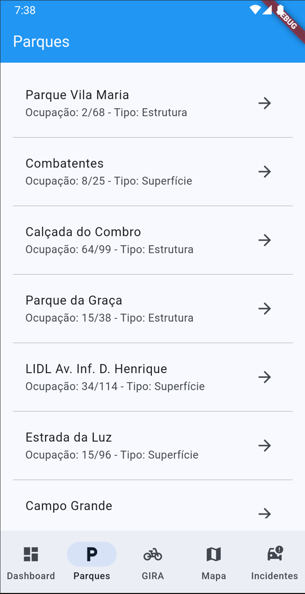
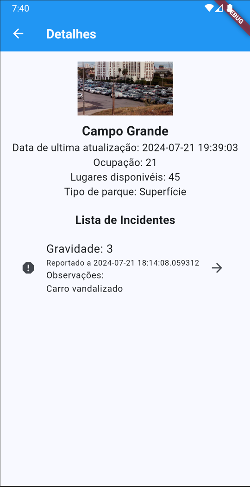
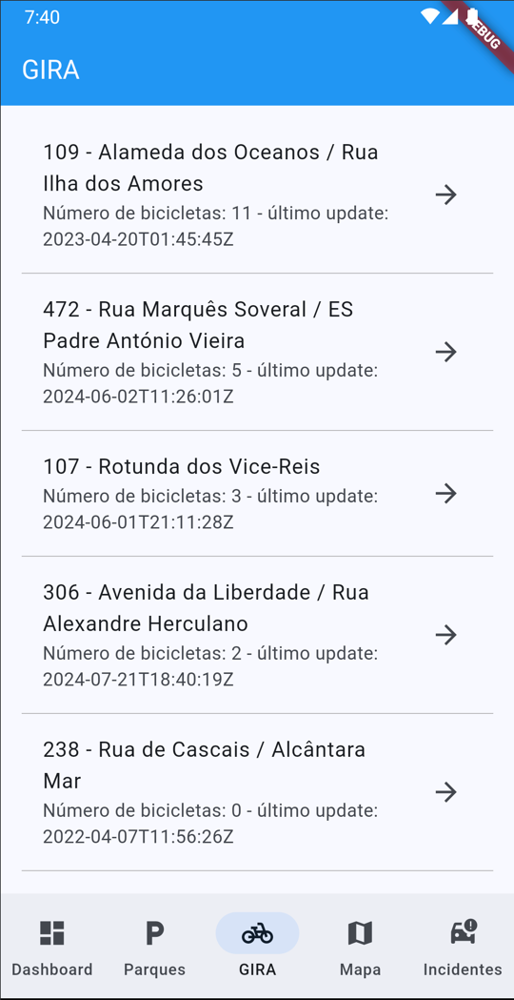
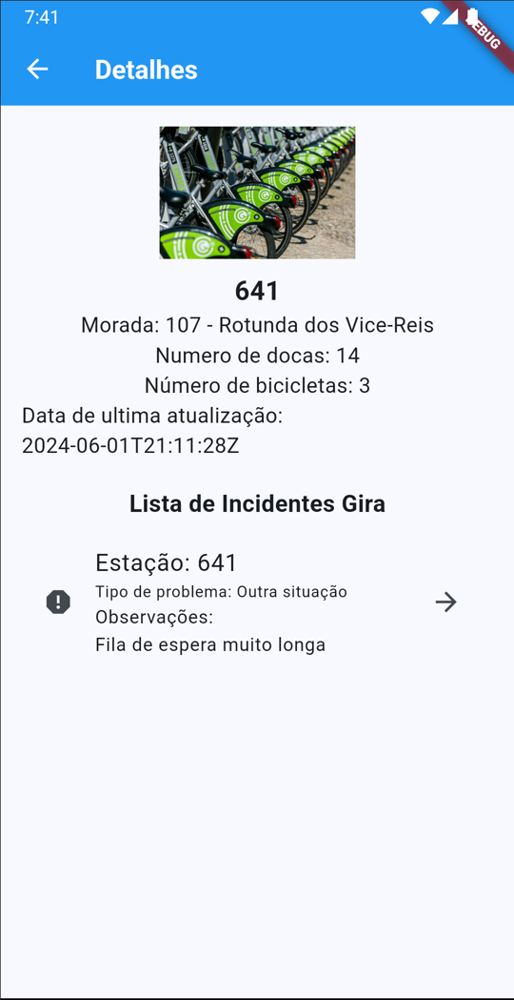
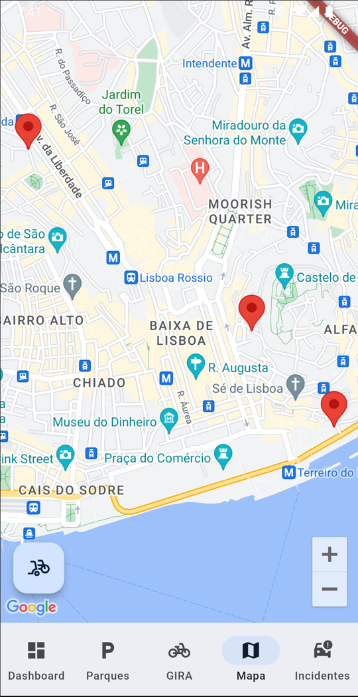
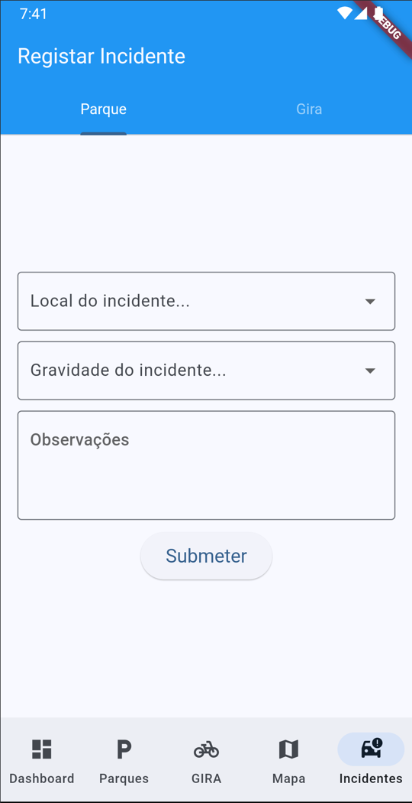

# Projeto Flutter CM 23/24

# Aluno: João Joyce nº 21805677

## Screenshots

## Requisitos 
- Arquitetura da aplicação
- Dashboard (Implemantado)
- Apresentação do google maps (Implemantado)
- Apresentar incidentes vindos da BD (Implemantado)
- Formulário regista na BD (Implemantado)
- Geolocalização 
- Funcionamento offline (Não testatdo)
- Testes Unitários / Integração (Não Implementado)
- Apresentação do google maps (GIRA) (Implemantado)
- Markers com os parques GIRA (Implemantado)
- dados do parque Gira (Implemantado)
- Apresentar incidentes vindos da BD (Implemantado)
- Formulário GIRA (Implemantado)

## Previsão de Nota: 13/14

## Descrição Textual da arquitetura
- Esta aplicação apresenta uma navegação precistente (TabBar) com 5 possiveis items de navegação. 
- No dashboard é possivel encontrar uma lista de todos os incidentes reportados.
- No parques está a lista de todos os parques é tambem atraves desta lista que se pode selecionar um parque e apresentar os detalhes e incidentes associados ao mesmo
- Na GIRA está a lista de todos as estações é tambem atraves desta lista que se pode selecionar uma estação e apresentar os detalhes e incidentes associados á mesma
- No Mapa é visivel inicalmente os markers dos parques, mas clicando no FAB no canto inferior esquerdo o mapa passa a apresentar os markers das estações gira, selecionando algum destes é apresentado o detalhe em questão
- No Incidentes é possivel reportar incidentes, tanto para parques como para estações GIRA, uma vez que é possivel usar as tabs no topo do ecrã para selecionar o report desejado

# Video
- link : https://youtu.be/h072DAMn6l8?si=9XyujhHtSK8bCTpL

## Clases de Lógica:
- as classes de logica presentes no projeto seguem relativamente a mesma estrututa, a maior parte inclui funções para para ler da API da emel, bem como ir buscar ou colocar dados na BD
- existe tambem as classes responsavies por popular os dropdrowns nos reports (gira_listing e park_listing)
- as classes gira_marker e park_marker têm a lógica necessária para criar os markers visivies no mapa
- está ainda tambem presente as classes responsavies pelos dados dos reports introduzidos pelos utilizadores
- a classe combined_reports é utilizada unicamente no dashboard para apresentar os reports GIRA e parques numa só lista (serve como uma especie de adapter recebendo os varios tipos de dados de ambos os reports)

## Repositorio GitHub:  https://github.com/joyce-21805677/projeto_flutter_21805677

### Fontes
- Videos disponibilizados no moodle
- site flutter e dart
- StackOverflow
- Chatgpt: utilizado para rapidamente colocar prints de debug de modo a acelerar o desenvolvimento